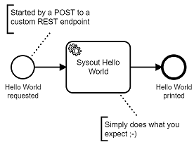

# How to run Camunda on Pivotal Cloud Foundry (PCF)

In the examples in this repo I show how to run 

* a simple workflow in BPMN
* on Camunda 
* in a PCF environment. 

The workflow is intensionally super simple to concentrate on the architecture and deployment aspects.

For the demos I use Pivotal Web Services as managed PCF, but all descriptions also apply if you run Cloud Foundry on premise. 

# Approaches

There are many ways of running Camunda (I wrote about this in [Architecture options to run a workflow engine](https://blog.bernd-ruecker.com/architecture-options-to-run-a-workflow-engine-6c2419902d91)). For today I concentrate on the **two default architectures** we recommend:

# Tutorials & Screencasts

## Run Camunda as a service

Camunda will be an own deployment on PCF, so you can connect to it via REST and [External Tasks](https://docs.camunda.org/manual/latest/user-guide/process-engine/external-tasks/). 

Use this approach in case you are not developing in Java and Spring Boot. 

1. Run **[Camunda as a service on PCF](engine-as-a-service/)**
2. Run the **[Node.JS sample application](nodejs-sample/)** using that Camunda Service

Note that Camunda does **not yet provide a managed service**, but we are working on it. This will be a good alternative to run the engine as a service yourself. 

If you run PCF on premise you could also think about creating a [PCF tile](https://docs.pivotal.io/tiledev/1-12/tile-structure.html) for Camunda if you use it multiple times in your universe.

## Embed Camunda into your Spring Boot application

This setup is only possible if you develop in Java. Use it if Spring Boot is what you are doing anyway. It is a very easy setup and smoothly integrated into common best practices.

1. Run the **[Spring Boot app with an embedded engine on PCF](spring-boot-embedded-engine-sample/)**

# Run Camunda Optimize on PCF

[Camunda Optimize](https://camunda.com/products/optimize/) is a business analysis tool that can make sense of data in Camunda engines. Please not that this is not available within the community edition and needs an [enterprise subscription](https://camunda.com/enterprise/). Nevertheless I wanted to include it here, as customers ask about running it on PCF.

1. Run a sample workflow using one of the approaches above
2. Follow the how-to **[Optimize as a Service](optimize-as-a-service/)** to run optimize and analyse the workflow you just deployed.

# Deploying on PCF: Why not Docker? 

In order to run applications on PCF you typically leverage so called build packs. As the Camunda engine is written in Java you leverage the [Java build pack of PCF](https://github.com/cloudfoundry/java-buildpack) (which is available by default).

[Camunda also provides docker images](https://github.com/camunda/docker-camunda-bpm-platform). While you can run docker images on PCF it is [not the recommend way](https://docs.pivotal.io/tiledev/2-2/bosh-release.html):

> While this \[Docker\] is a great, easy way to deploy your service on PCF, we do not recommend this as a long-term, production-ready solution. There is really no benefit of running your service in containers on the VMs, and it does have a number of operational (“day 2”) drawbacks:

> \- You introduce more software (Docker) which needs to be kept up-to-date, and has the potential for issues, downtime, and security vulnerabilities.

> \- You can no longer take advantage of the patching capabilities of PCF for stemcells and application dependencies, such as frameworks and libraries. Instead, you become directly responsible for managing all software that is in the Docker images you deploy.

In this example post I will only use the recommended way of the Java build pack.

