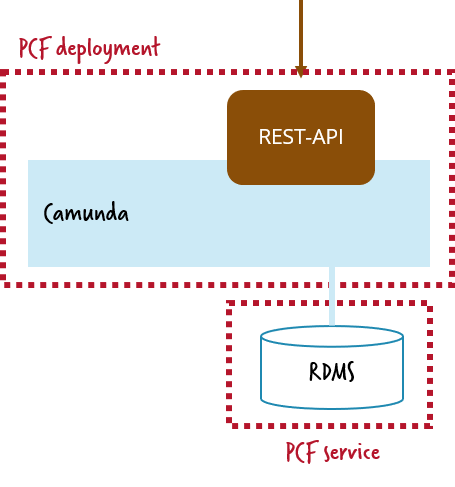

# Run Camunda as a service on PCF

In order to leverage Camunda as a service you need to run it as own deployment in PCF and connect to it via REST API:



The recommended way to run Camunda on PCF is to create and deploy a simple Spring Boot application that just provides Camunda. This folder contains a ready-to-use example.

You have mutliple alternatives to deploy to PCF 

* Local build and push
* CI/CD
* Building your own tile

# Screencast

This video walks you through the whole procedure and deploys the [Node.JS Sample Application](../../../nodejs-sample/) afterwards:

<a href="http://www.youtube.com/watch?feature=player_embedded&v=e0rdC8ElxLk" target="_blank"></a>


# Deploy via CI/CD

If you do not fancy a local build, e.g. because you are not a Java shop, you can leverage your CI/CD to build and deploy.

As example [I use Travis-CI to deploy the Camunda service on PCF using this configuration](https://github.com/berndruecker/camunda-on-pcf/blob/master/.travis.yml). Make sure you set environment variables for your PCF credentials:


# Local build and cf push

* Add a service for a **relational database** named _camunda-db_. I used [ElephantDB](https://docs.run.pivotal.io/marketplace/services/elephantsql.html) as managed service offering of PostgreSQL. But any [database supported for Camunda](https://docs.camunda.org/manual/latest/introduction/supported-environments/) will do.
* Install [PCF CLI](https://docs.cloudfoundry.org/cf-cli/install-go-cli.html) locally.
* **Login** (use _api.run.pivotal.io_ as API endpoint if you run on PCF in the cloud):
```
cf login
```
* Build and push the application. Check the [PCF manifest file](https://github.com/berndruecker/camunda-on-pcf/blob/master/spring-boot-embedded-engine-sample/manifest.yml) to make sure that it references the right database service.
```
mvn clean install && cf push -p target/*.jar
```

*Hint: In on-prem installations of PCF the java buildpack might not yet be available, then you need to specify that in your command:*

```
cf push -p target/*.jar https://github.com/cloudfoundry/java-buildpack.git
```

# Use it

* Now you can access your application by either triggering your REST endpoint or open up the Camunda web applications. PCF as default creates an URL that matches exactly your application name, in my example that is [https://camunda-on-pcf-engine-as-a-service.cfapps.io](https://camunda-on-pcf-engine-as-a-service.cfapps.io/):


No you can use the **[Camunda REST API](https://docs.camunda.org/manual/latest/reference/rest/)** to access the engine, e.g. to query deployed process definitions:

```
curl http://camunda-on-pcf-engine-as-a-service.cfapps.io/rest/history/process-definition
```


## Camunda as User-Provided Service Instances

On PCF you have the option to promote certain deployments as spo called [User-Provided Service Instances](https://docs.cloudfoundry.org/devguide/services/user-provided.html). This allows to define certain metadata attached to your service, especially the endpoint (Host, URL) and credentials.

```
cf cups ...
```

 This allows that deployments, which use Camunda, can simply read this data from the service description as described e.g. in [Service Bindings in Node.JS](https://docs.run.pivotal.io/buildpacks/node/node-service-bindings.html).


## Run example applications

Now you can run one of the sample applications of this tutorial:

* [Node.JS Sample](../nodejs-sample/)

# Screencast

This video walks you through the whole procedure:

ADD YOUTUBE VIDEO HERE