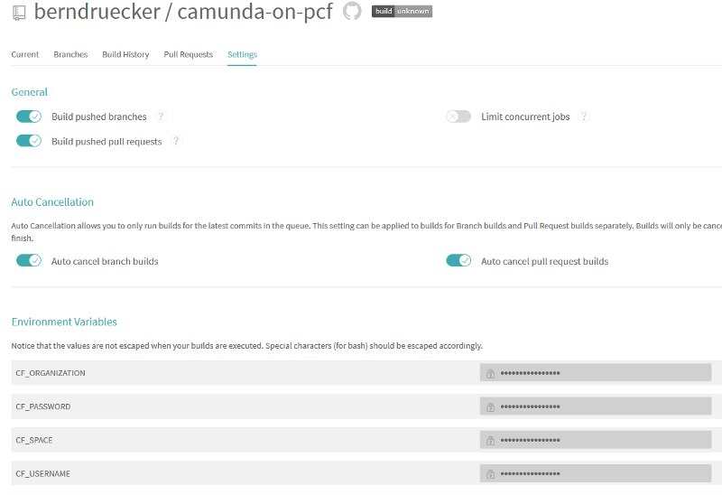

# Run Camunda as a service on PCF

In this scenario you run Camunda as a service and allow to connect to it via REST API: 


The recommended way to run a Camunda engine on PCF is to create and deploy a simple Spring Boot application that just provides Camunda. This project is a ready-to-use example.

You can deploy it to PCF by 

* Local build and push
* CI/CD
* Building your own tile

## Deploy via CI/CD

If you do not fancy a local build, e.g. because you are not a Java shop, you can leverage your CI/CD to build and deploy.

As an example [I use Travis-CI to deploy the Camunda service on PCF by this configuration](https://github.com/berndruecker/camunda-on-pcf/blob/master/.travis.yml). Make sure you set environment variables for your PCF credentials:



## Local build and cf push

* Add a service for a **relational database** named _camunda-db_. I used [ElephantDB](https://docs.run.pivotal.io/marketplace/services/elephantsql.html) as managed service offering of PostgreSQL. But any [database supported for Camunda](https://docs.camunda.org/manual/latest/introduction/supported-environments/) will do.
* Install [PCF CLI](https://docs.cloudfoundry.org/cf-cli/install-go-cli.html) locally.
* **Login** (use _api.run.pivotal.io_ as API endpoint if you run on PCF in the cloud):
```
cf login
```
* Build and push the application. Check the [PCF manifest file](https://github.com/berndruecker/camunda-on-pcf/blob/master/spring-boot-embedded-engine-sample/manifest.yml) to make sure that it references the right database service.
```
mvn clean install && cf push -f target/*.jar
```

## Use it

* Now you can access your application by either triggering your REST endpoint or open up the Camunda web applications. PCF as default creates an URL that matches exactly your application name, in my example that is [https://camunda-on-pcf-engine-as-a-service.cfapps.io](https://camunda-on-pcf-engine-as-a-service.cfapps.io/):


No you can use the **[Camunda REST API](https://docs.camunda.org/manual/latest/reference/rest/)** to access the engine, e.g. to query deployed process definitions:

```
curl http://camunda-on-pcf-engine-as-a-service.cfapps.io/rest/history/process-definition
```

#### Screencast

This video walks you through the whole procedure:

ADD YOUTUBE VIDEO HERE