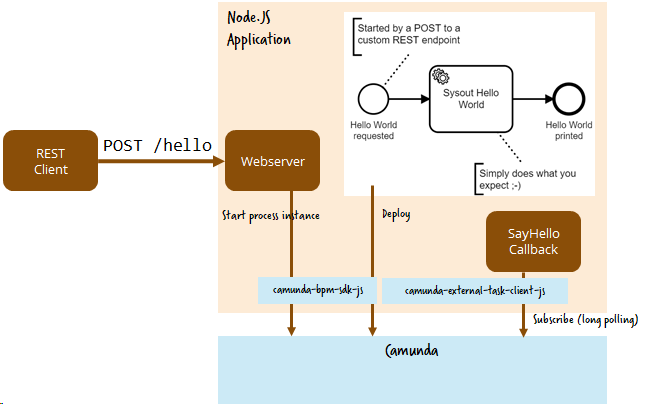

# Use Camunda Server in your Node.JS application

In this scenario you run Camunda as a service.

**Set-up the Camunda [Engine as a Service](../engine-as-a-service/) on PCF first.**

 In this tutorial I assume that Camunda is available via REST on https://camunda-on-pcf-engine-as-a-service.cfapps.io.



# Screencast

This video walks you through the whole procedure:

<a href="http://www.youtube.com/watch?feature=player_embedded&v=e0rdC8ElxLk" target="_blank"></a>

# Step-by-step

1. We will leverage the [REST API](https://docs.camunda.org/manual/latest/reference/rest/) as well as the language client for [External Tasks]https://github.com/camunda/camunda-external-task-client-js):

```
var {Client} = require("camunda-external-task-client-js");  
```

2. [Deploy the workflow model during application startup](https://github.com/berndruecker/camunda-on-pcf/blob/master/nodejs-sample/index.js#L34) (you could also do that via CI/CD, but the lifecycle management is easier like this and the Camunda engine detects duplicates and don’t deploy them again).

3. [Create a webserver to serve your REST API and start process instances](https://github.com/berndruecker/camunda-on-pcf/blob/master/nodejs-sample/index.js#L66).

4. [Subscribe a worker to the external task](https://github.com/berndruecker/camunda-on-pcf/blob/master/nodejs-sample/index.js#L27) to do the sysout when a process instance arrives there:

```
client.subscribe("sysout", async function({ task, taskService }) {  
  console.log('Hello World: %s', task.variables.get("text"));  
  await taskService.complete(task);  
});
```

5. Build and run this application locally:

```
npm start
```

6. Deploy it on PCF:

```
cf push
```

Now you can send REST requests:

```
curl --request POST -H "Content-Type: application/json" --data '{"someText":"some text for hello world"}'
https://camunda-on-pcf-nodejs-sample.cfapps.io/hello
```

